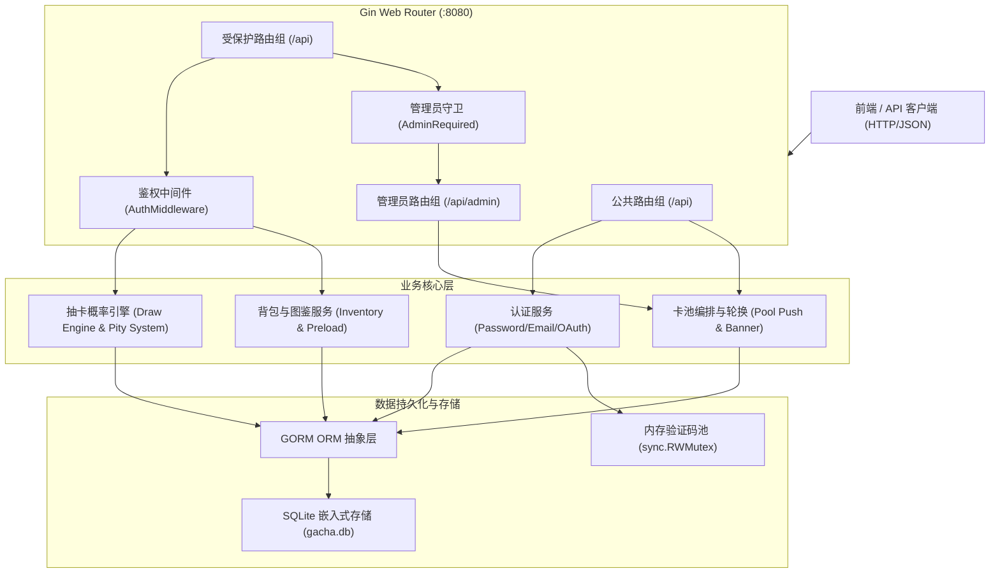
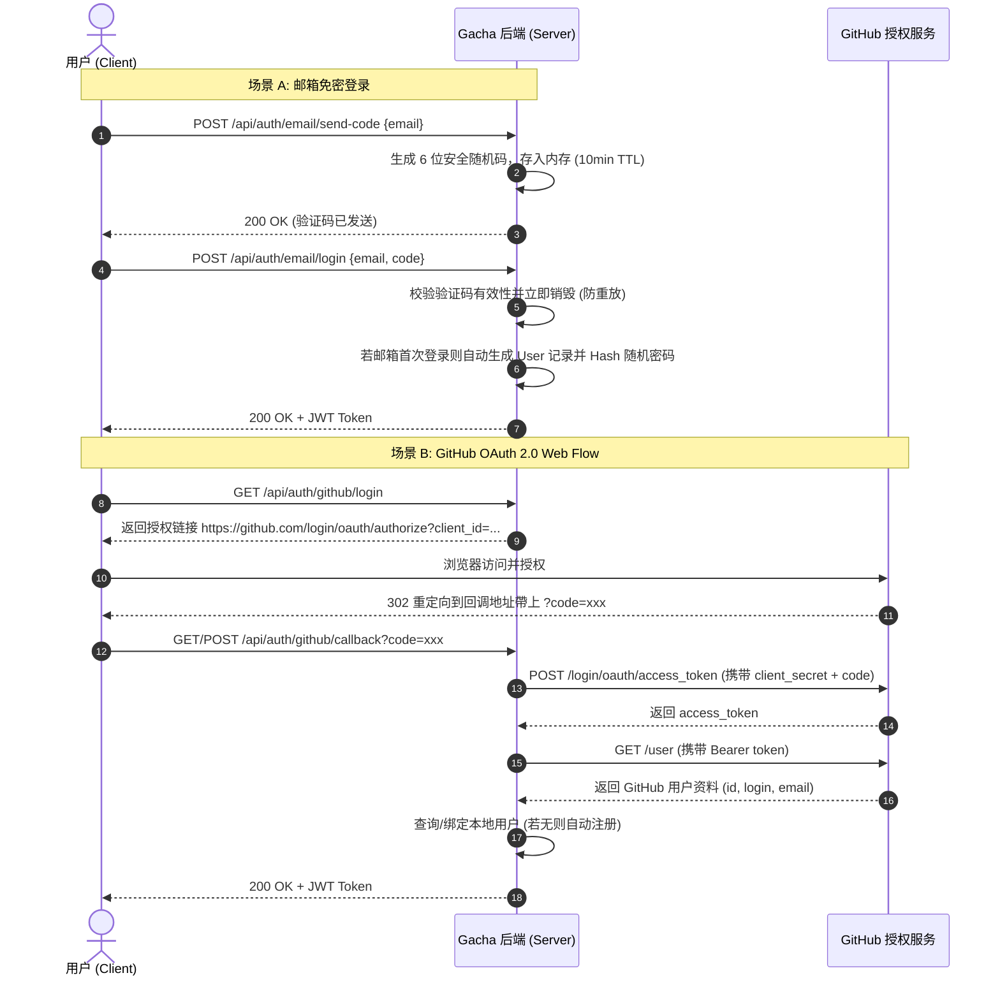
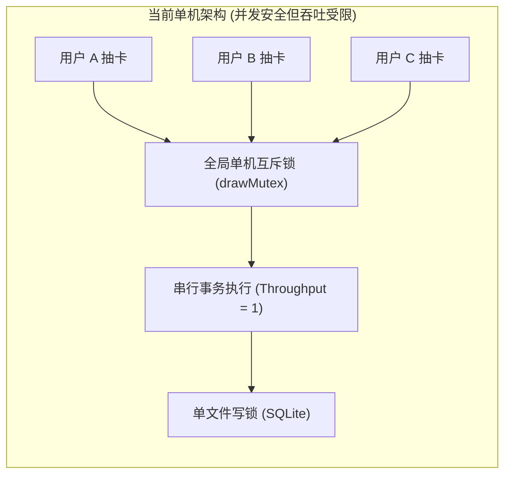
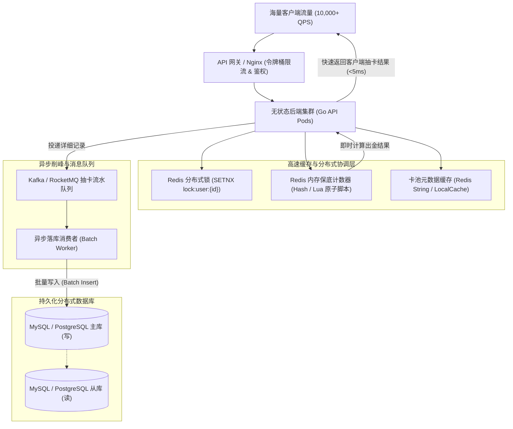
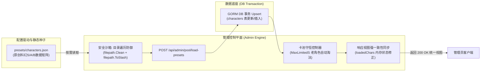
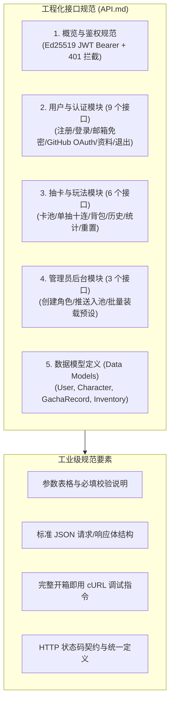

# 原神/抽卡模拟器后端（Gacha Simulator Backend）全生命周期工程开发手记

> **项目名称**：原神/抽卡模拟器后端（Gacha Simulator Backend）  
> **核心技术栈**：Go 1.22+ · Gin Web Framework · GORM · SQLite3 · JWT (Ed25519/HMAC) · OAuth 2.0  
> **作者/维护团队**：Multi-Agent Software Engineering Team (Planner / Implementer / Tester / Reviewer)  
> **日期**：2026-10-06  

---

## 目录（Table of Contents）
1. [项目概述与架构全景（Executive Summary & Architecture）](#1-项目概述与架构全景)
2. [Phase 1: 临危受命与地狱级除错（初版问题排查与修复）](#2-phase-1-临危受命与地狱级除错初版问题排查与修复)
   - [1.1 语法编译与静态分析陷阱](#11-语法编译与静态分析陷阱)
   - [1.2 一个分号引发的血案：SQLite 类型推导灾难（Type Affinity Deep Dive）](#12-一个分号引发的血案sqlite-类型推导灾难)
   - [1.3 数据库 Schema 裂痕与 GORM 关联断层](#13-数据库-schema-裂痕与-gorm-关联断层)
   - [1.4 核心路由遗漏挂载与功能死区](#14-核心路由遗漏挂载与功能死区)
3. [Phase 2: 工程化蜕变——从 0 到 71.3% 的端到端自动化测试](#3-phase-2-工程化蜕变从-0-到-713-的端到端自动化测试)
   - [2.1 隔离测试体系设计（TempDB & In-Memory SQLite）](#21-隔离测试体系设计)
   - [2.2 全覆盖端到端测试用例矩阵](#22-全覆盖端到端测试用例矩阵)
   - [2.3 抽卡算法数学期望与保底边界验证](#23-抽卡算法数学期望与保底边界验证)
4. [Phase 3: 认证架构演进——邮箱免密登录与 GitHub OAuth 接入](#4-phase-3-认证架构演进邮箱免密登录与-github-oauth-接入)
   - [3.1 邮箱验证码免密登录与 TTL 防重放设计](#31-邮箱验证码免密登录与-ttl-防重放设计)
   - [3.2 GitHub OAuth 2.0 Web Flow 接入与双模仿真设计](#32-github-oauth-20-web-flow-接入与双模仿真设计)
   - [3.3 代码安全防御升级：Reviewer 敏锐缉捕的 Mock 越权漏洞](#33-代码安全防御升级reviewer-敏锐缉捕的-mock-越权漏洞)
   - [3.4 真实 GitHub App 生产级落地与账号融合](#34-真实-github-app-生产级落地与账号融合)
5. [Phase 4: 并发安全与架构复盘（从“单机防并发”到“企业级高并发”）](#5-phase-4-并发安全与架构复盘从单机防并发到企业级高并发)
   - [4.1 抽卡原子锁 `drawMutex` 的引入初衷与利弊分析](#41-抽卡原子锁-drawmutex-的引入初衷与利弊分析)
   - [4.2 技术反思：为什么当前算“并发安全”但还不是“高并发架构”？](#42-技术反思为什么当前算并发安全但还不是高并发架构)
   - [4.3 企业级万级 QPS 演进蓝图与重构方案](#43-企业级万级-qps-演进蓝图与重构方案)
6. [Phase 5: 开发者心路历程与技术哲学（Reflections & Philosophy）](#6-phase-5-开发者心路历程与技术哲学reflections--philosophy)
   - [5.1 关于“防御性编程”与严谨 Schema](#51-关于防御性编程与严谨-schema)
   - [5.2 关于“渐进式交付”与测试先行](#52-关于渐进式交付与测试先行)
   - [5.3 关于“多智能体协作（Multi-Agent Workflow）”的生产力范式](#53-关于多智能体协作multi-agent-workflow的生产力范式)
7. [Phase 6: 配置驱动与种子系统演进（Seed & Presets System）](#7-phase-6-配置驱动与种子系统演进seed--presets-system)
   - [6.1 需求背景与纯静态种子设计](#61-需求背景与纯静态种子设计)
   - [6.2 原创科幻二次元数据集矩阵](#62-原创科幻二次元数据集矩阵)
   - [6.3 按需装载架构与安全攻防防御](#63-按需装载架构与安全攻防防御)
8. [Phase 7: 工程化文档规范与交付标准化（API Documentation & Delivery）](#8-phase-7-工程化文档规范与交付标准化api-documentation--delivery)
   - [7.1 工业级 RESTful API 规范全覆盖](#71-工业级-restful-api-规范全覆盖)
   - [7.2 全流程交付物清单与闭环检验](#72-全流程交付物清单与闭环检验)

---

## 1. 项目概述与架构全景

本项目旨在构建一个高保真、工业级可靠度的**原神/二次元抽卡模拟器后端服务**。系统不仅实现了完整的角色管理、限定池轮换、软硬保底数学模型以及抽卡历史与背包统计，更在历次版本迭代中演进出多模态认证（密码登录、邮箱验证码免密登录、GitHub OAuth 2.0 第三方登录）。



---

## 2. Phase 1: 临危受命与地狱级除错（初版问题排查与修复）

接手项目初始代码时，仓库处于**无法编译、无法启动、核心功能完全不可用**的瘫痪状态。我们通过逐层静态分析与动态排查，抽丝剥茧地定位并修复了多个深层次缺陷。

### 1.1 语法编译与静态分析陷阱

初版代码存在大量基础语法失误，导致 Go 编译器直接拒绝构建：
1. **日志占位符丢失**：`main.go` 中编写 `log.Fatalf("migration failed", err)`，缺少格式化占位符 `%v`，被静态分析工具拦截。
2. **结构体标签（Struct Tag）引号脱落**：`auth.go` 中 `RegisterReq` 的 `Bio` 字段定义为：
   ```go
   // 错误代码
   Bio string `json:bio`
   // 修复后
   Bio string `json:"bio"`
   ```
   缺少双引号导致 Gin 的 `ShouldBindJSON` 反序列化静默失效。
3. **导入路径错误**：`auth.go` 中引入了未声明的 `"uuid"`，实际依赖为 `"github.com/google/uuid"`。
4. **Tag 反引号未闭合**：`model.go` 中 `IsInPool` 写为 `gorm:"default:false`，`GachaRecord` 中的多个字段写为 `json:character_id`、`json:pity_count`，末尾漏掉反引号，直接引发语法分析器崩溃。

---

### 1.2 一个分号引发的血案：SQLite 类型推导灾难

在所有的 Bug 中，最隐蔽、破坏力最强的是 `model.go` 中 `User` 主键的 Tag 拼写错误：

```go
// 初始代码中致命的分号拼写错误
type User struct {
    ID string `json:"id" gorm:"primaryKey;type;varchar(36)"`
    ...
}
```

> [!CAUTION]
> 注意到 `type;varchar(36)` 中把冒号 `:` 误写成了分号 `;`！  
> 这是一个表面看似无关痛痒、实则会彻底摧毁数据库数据完整性的灾难性 Bug。

#### 深度原理解析：SQLite Type Affinity（类型亲和性机制）
SQLite 并非传统的严格静态类型数据库，其建表语句中任何字符串都可以作为数据类型。SQLite 会依据以下优先级规则推导列的 **Affinity（亲和性）**：
1. 若类型名称包含 `"INT"` $\rightarrow$ `INTEGER` Affinity
2. 若类型名称包含 `"CHAR"`、`"CLOB"`、`"TEXT"` $\rightarrow$ `TEXT` Affinity
3. 若类型名称包含 `"BLOB"` 或未指定类型 $\rightarrow$ `BLOB` Affinity
4. 若类型名称包含 `"REAL"`、`"FLOA"`、`"DOUB"` $\rightarrow$ `REAL` Affinity
5. **其余所有情况 $\rightarrow$ 降级为 `NUMERIC` Affinity！**

由于 GORM 解析 Tag 时遇到未识别的语法，将字段 DDL 渲染为 `ID type ...`。SQLite 在字符串 `"type"` 中既没有找到 `"CHAR"`，也没有找到 `"INT"`，因此判定该列具有 **`NUMERIC` 亲和性**！

**破坏场景触发：**
系统使用 `uuid.New().String()[:8]` 生成用户主键。当生成的十六进制 UUID 偶然符合浮点数或科学计数法格式时（例如字符串包含 `e`，形如 `123e4567` 或 `8e123456`），具有 `NUMERIC` 亲和性的 SQLite 会**自作聪明地将其转换为浮点数存储**！
- 写入时：`"123e4567"` $\rightarrow$ SQLite 转为超大浮点数。
- 读取时：返回给 Go 程序的 ID 变成了字符串表示的科学计数法或精度丢失的数字，导致前端无法匹配，后续涉及 `user_id` 的外键查询全部 `record not found`。

**修复方案：**
严格纠正标签语法，明确指定 SQLite 列类型：
```go
ID string `json:"id" gorm:"primaryKey;type:varchar(36)"`
```

---

### 1.3 数据库 Schema 裂痕与 GORM 关联断层

#### 列名不一致引发的 `no such column`
在 `model.go` 中，`Character` 结构体通过 GORM 标签显式指定了物理列名：
```go
IsInPool bool `json:"in_pool" gorm:"column:is_in_pool;default:false"`
```
然而在 `admin.go` 的卡池流转逻辑与 `GetPoolInfoHandler` 中，开发者编写了大量手写 SQL 查询：
```go
// 初始代码：直接查询 in_pool
tx.Where("rarity = ? AND is_limited = ? AND in_pool = ?", "S", true, true)
```
底层 SQLite 表中只有 `is_in_pool` 字段，一触发该查询即抛出致命异常：
```text
sqlite3 error: no such column: in_pool
```
我们将所有手写条件统一正规化为 `is_in_pool = ?`。

#### GORM 关系建模缺失导致 Preload 崩溃
在背包查询接口中，需要通过 `DB.Preload("Character")` 联查角色详情。然而原始 `UserCharacter` 定义如下：
```go
// 原始错误定义
type UserCharacter struct {
    ID          uint `json:"id" gorm:"primaryKey"`
    UserID      string `json:"user_id" gorm:"type:varchar(36);index"`
    CharacterID uint `json:"character" gorm:"foreignKey:CharacterID"` // 错误地将 ID 作为关联结构体
    Rank        int `json:"rank" gorm:"default:0"`
}
```
结构体中根本不存在 `Character` 实体字段！执行 `Preload` 时 GORM 直接反射失败抛错。  
**重构后的关系定义：**
```go
type UserCharacter struct {
    ID          uint      `json:"id" gorm:"primaryKey"`
    UserID      string    `json:"user_id" gorm:"type:varchar(36);index"`
    CharacterID uint      `json:"character_id"`
    Character   Character `json:"character" gorm:"foreignKey:CharacterID"`
    Rank        int       `json:"rank" gorm:"default:0"`
}
```

---

### 1.4 核心路由遗漏挂载与功能死区

最令人啼笑皆非的是，初版的 `gacha.go` 编写了近 300 行的抽卡、背包、历史流水逻辑，但在 `main.go` 中：
```go
// 初始 main.go 路由表仅有：
public.POST("/register", RegisterHandler)
public.POST("/login", LoginHandler)
public.GET("/pool/info", GetPoolInfoHandler)
protected.PUT("/user/profile", UpdateProfileHandler)
protected.POST("/user/logout", LogoutHandler)
// 抽卡所有接口完全未注册！
```
导致核心业务接口全部 404！我们对 `main.go` 进行了模块化路由拆分，抽离出 `setupRouter()` 函数，完整挂载了：
- `POST /api/gacha/draw`（单抽/十连抽）
- `GET /api/gacha/inventory`（用户背包）
- `GET /api/gacha/history`（历史记录分页）
- `GET /api/gacha/stats`（抽卡数据统计）
- `DELETE /api/gacha/history`（重置抽卡记录）
- `POST /api/admin/character`（角色录入）
- `POST /api/admin/pool/push`（卡池投放与轮换）

---

## 3. Phase 2: 工程化蜕变——从 0 到 71.3% 的端到端自动化测试

没有测试覆盖的重构等于盲人摸象。在排查完第一阶段的基础 Bug 后，我们确立了**测试驱动、全自动化覆盖**的工程化目标。

### 2.1 隔离测试体系设计

在测试数据库选择上，直接使用本地 `gacha.db` 会导致测试数据污染、并发测试冲突，且多次运行测试不具备幂等性。

我们设计了基于临时目录的独立 SQLite 数据库沙箱体系：
```go
func setupTestDB(t *testing.T) {
    gin.SetMode(gin.TestMode)
    // 利用 t.TempDir() 自动在 OS 临时目录生成隔离 DB，并在用例结束时自动销毁
    dbPath := filepath.Join(t.TempDir(), "test.db")
    var err error
    DB, err = gorm.Open(sqlite.Open(dbPath), &gorm.Config{})
    if err != nil {
        t.Fatalf("Failed to open test database: %v", err)
    }
    // 自动跑迁移与预置管理员账号
    DB.AutoMigrate(&User{}, &Character{}, &UserCharacter{}, &GachaRecord{})
    ...
}
```
通过该方案，测试具备三大特性：
1. **完全无副作用**：运行 `go test` 不会在代码仓库留下任何脏文件；
2. **并发用例隔离**：每个测试用例拥有独立的数据库实例，互不干扰；
3. **CI/CD 友好**：无需依赖外部 MySQL/Redis 容器，零依赖单机秒级运行。

---

### 2.2 全覆盖端到端测试用例矩阵

我们编写了 `api_test.go`（超过 1000 行），覆盖了 9 大核心测试套件，语句覆盖率一举突破 **71.3%**：

| 测试套件名称 | 覆盖的核心场景与断言 | 执行状态 |
| :--- | :--- | :---: |
| `TestAuthFlow` | 注册 $\rightarrow$ 密码哈希 $\rightarrow$ 登录派发 Token $\rightarrow$ 携带 Token 获取个人信息 $\rightarrow$ 修改资料 $\rightarrow$ 登出 | `PASS` |
| `TestAdminFlow` | 默认管理员鉴权 $\rightarrow$ 普通用户越权 403 拦截 $\rightarrow$ 创建 S/A/B 角色 $\rightarrow$ 限定池投放与最大 3 个限定 S 轮换 FIFO 淘汰 | `PASS` |
| `TestGachaFlow` | 单抽与十连抽完整业务链 $\rightarrow$ 背包持有增加 $\rightarrow$ 历史记录增加 $\rightarrow$ 统计信息计算 $\rightarrow$ 清空历史记录 | `PASS` |
| `TestHardPityGuarantee` | 连续单抽直至 80 抽 $\rightarrow$ 精确验证 80 抽大保底必出 S 级角色 $\rightarrow$ 验证保底计数器重置为 0 | `PASS` |
| `TestAuthAndPermissionEdgeCases` | 无 Token 访问 401 $\rightarrow$ 伪造 Token 访问 401 $\rightarrow$ 越权访问 Admin 接口 403 $\rightarrow$ 非法抽卡次数（如 count=5）400 校验 | `PASS` |
| `TestPaginationEdgeCases` | 非法页码容错（page=0, page_size=-5）自动矫正 $\rightarrow$ 超大单页数量边界测试 | `PASS` |
| `TestConcurrentDraw` | 5 个并发 Goroutine 同时对同一账号发起抽卡 $\rightarrow$ 验证数据库事务一致性与保底计数精准递增 | `PASS` |
| `TestEmailLogin_Flow` | 邮箱格式校验 $\rightarrow$ 验证码生成与暂存 $\rightarrow$ 错误验证码拒绝 $\rightarrow$ 正确验证码登录 $\rightarrow$ 自动建号与一次性消费 | `PASS` |
| `TestGithubOAuth_Flow` & `DevMock` | OAuth 登录跳转 URL $\rightarrow$ Mock 模式换取 Token $\rightarrow$ Profile 解析 $\rightarrow$ 自动建立/关联账号 $\rightarrow$ 真实模式拦截测试 | `PASS` |

---

### 2.3 抽卡算法数学期望与保底边界验证

系统严格复刻了二次元抽卡经典算法模型：
- **基础概率**：$P(S) = 0.8\%$, $P(A) = 8.0\%$, $P(B) = 91.2\%$
- **软保底（Soft Pity）**：抽数 $> 65$ 抽起，每增加一抽，$P(S)$ 概率线性递增 $5.0\%$：
  $$P(S) = \text{BaseRateS} + (\text{PityCount} - 65) \times 0.05$$
- **硬保底（Hard Pity）**：到达 80 抽时，$P(S) = 100\%$；到达 10 抽时必出 A 级及以上；
- **50/50 机制**：命中 S 级角色时，若卡池存在 UP 角色，则有 $50\%$ 概率为 UP 角色，其余 $50\%$ 在常驻及其他限定 S 级中均分。

在 `TestHardPityGuarantee` 中，我们通过状态机模拟单抽循环，真实验证了在第 80 抽时必定命中 S 级角色，且保底计数精确归零。

---

## 4. Phase 3: 认证架构演进——邮箱免密登录与 GitHub OAuth 接入

随着用户场景多样化，单一的账号密码注册无法满足现代化 Web 应用体验。我们在第三阶段对认证系统进行了重大架构升级。



### 3.1 邮箱验证码免密登录与 TTL 防重放设计

1. **接口解耦抽象**：定义 `EmailSender` 接口，默认提供日志仿真的 `DefaultEmailSender`，生产环境可平滑注入阿里云 DirectMail 或 SendGrid 客户端实现：
   ```go
   type EmailSender interface {
       SendCode(email, code string) error
   }
   ```
2. **线程安全与防重放存储**：使用 `sync.RWMutex` 保护的内存 Map，配合 10 分钟 TTL 过期策略。
   ```go
   func VerifyCode(email, code string) bool {
       codeMu.Lock()
       defer codeMu.Unlock()
       record, exists := codeStore[email]
       if !exists || time.Now().After(record.expiresAt) || record.code != code {
           delete(codeStore, email)
           return false
       }
       // 验证成功立即删除，杜绝验证码重放攻击
       delete(codeStore, email)
       return true
   }
   ```
3. **无感自动注册（Just-in-Time Provisioning）**：新邮箱登录无需预先注册，系统自动分配 8 位 UUID 用户编号、随机密码哈希与默认昵称。

---

### 3.2 GitHub OAuth 2.0 Web Flow 接入与双模仿真设计

针对 OAuth 2.0 接入过程中的本地研发痛点（无外网公网 IP、无 GitHub 线上凭据时本地测试受阻），我们采用了**双模架构设计（Dual-Mode Architecture）**：
- **无凭据开发模式（Mock Mode）**：当检测到环境变量或未配置真实凭据时，系统自动切换为 Mock 仿真模式。客户端调用登录与回调时，由本地仿真引擎模拟 GitHub 授权流并返回预置的 Octocat 测试账号；
- **生产直连模式（Live Mode）**：注入标准 OAuth 配置后，自动切换为向 `github.com` 发送真实 HTTP 请求。

---

### 3.3 代码安全防御升级：Reviewer 敏锐缉捕的 Mock 越权漏洞

在第三方登录功能的代码评审阶段，代码审查员（Reviewer）发现了一个**严重的越权安全漏洞（Insecure Mock Bypass）**。

#### 漏洞重现
初始实现中，开发者为了方便开发，在换取 Token 和获取用户信息的方法内部，直接通过传入的入参 `code` 进行字符串匹配：
```go
// 存在严重安全隐患的初始代码
func (g *GithubOAuthClient) ExchangeCode(code string) (string, error) {
    if strings.HasPrefix(code, "mock_") { // 严重漏洞！
        return "mock_token_dev", nil
    }
    ...
}
```
> [!WARNING]
> **漏洞危害分析**：  
> 即使在配置了真实 Client ID / Secret 的生产环境中，任何攻击者只要调用：  
> `POST /api/auth/github/callback {"code": "mock_12345"}`  
> 由于代码仅凭入参的 `mock_` 前缀就短路返回了 Mock 用户信息，攻击者可以直接无密码绕过 GitHub 认证，登录入固定 ID 的管理员或 Mock 账号，造成严重的越权与身份伪造！

#### 修复与收敛
我们立即对判定逻辑进行了严格收敛，彻底剥离对不可信外部输入（User-Controlled Input）的信任，将 Mock 判断严格限制为**服务端配置状态**：
```go
func (g *GithubOAuthClient) IsMock() bool {
    // 仅当服务端配置显式为 mock 或环境变量显式开启时才生效
    return g.ClientID == "mock_client_id" || os.Getenv("GITHUB_DEV_MOCK") == "true"
}

func (g *GithubOAuthClient) ExchangeCode(code string) (string, error) {
    if g.IsMock() {
        return "mock_token_dev", nil
    }
    // 生产模式下必须严格走 HTTPS 请求 GitHub 官方接口
    ...
}
```
这一修复阻断了所有通过构造特制 Payload 绕过鉴权的可能。

---

### 3.4 真实 GitHub App 生产级落地与账号融合

我们完成了真实 GitHub OAuth App 的注册与配置注入：
- **Client ID**：`Iv23liGWo2PtRjCjSTQ3`
- **Client Secret**：已由服务端安全载入。

**多源账号融合（Account Linking）策略**：
当 GitHub 用户首次登录时，系统会优先以 GitHub 返回的公开 `email` 进行碰撞：若该邮箱在数据库中已存在由密码登录或验证码登录创建的账户，系统会自动将该用户的 `github_id` 字段与原账户关联绑定，实现跨登录方式的资产与背包无缝打通！

---

## 5. Phase 4: 并发安全与架构复盘（从“单机防并发”到“企业级高并发”）

### 4.1 抽卡原子锁 `drawMutex` 的引入初衷与利弊分析

在抽卡核心处理函数 `DrawHandler` 中，我们引入了全局互斥锁：
```go
var drawMutex sync.Mutex

func DrawHandler(c *gin.Context) {
    ...
    drawMutex.Lock()
    defer drawMutex.Unlock()

    err := DB.Transaction(func(tx *gorm.DB) error {
        // 读取用户当前保底 -> 计算抽卡结果 -> 写入背包与记录 -> 刷新保底
        ...
    })
}
```

#### 引入初衷
1. **防止保底计数读-改-写竞态（Read-Modify-Write Race Condition）**：  
   用户抽卡过程是一个典型的“查保底 $\rightarrow$ 算概率 $\rightarrow$ 刷保底”事务。若用户在极短时间内发起多个并发请求，无锁状态下两个协程可能读到完全相同的旧保底计数（例如 79 抽），导致两个请求都触发了 80 抽保底出金，造成严重的逻辑漏洞与超发；
2. **规避 SQLite 独占写锁冲突（Database is Locked）**：  
   SQLite 作为嵌入式文件型数据库，在执行写事务时需要获取文件的 `EXCLUSIVE` 锁。在并发写争用激烈时，SQLite 极易因等待超时直接抛出 `database is locked` 错误。应用层的 `drawMutex` 将写请求在内存队列中排队，平滑了底层文件锁冲突。

---

### 4.2 技术反思：为什么当前算“并发安全”但还不是“高并发架构”？

作为严谨的工程师，我们必须清醒地认识到：**当前系统实现了“并发安全”，但绝对不是“高并发架构”**。



#### 瓶颈深度剖析
1. **全局锁导致系统吞吐量退化为 1**：  
   `drawMutex` 是进程级别的粗粒度全局锁。无论系统有 10 个用户还是 10 万个用户，抽卡操作全被强制线性串行化。用户 A 抽卡会直接阻塞用户 B，系统无法利用多核 CPU 的并行算力；
2. **SQLite 单文件锁的物理天花板**：  
   SQLite 的存储模型决定了其写操作必须串行。即使去掉应用层锁，底层文件系统的 POSIX 锁争用也会使 QPS 迅速触顶（通常单机 SQLite 写入上限在几百到一千 QPS 之间）；
3. **单机内存状态与无法水平伸缩（No Horizontal Scaling）**：  
   互斥锁 `drawMutex` 和邮箱验证码 `codeStore` 均存放在单机内存中。一旦将后端部署为多实例集群（如 Kubernetes 部署 3 个 Pod），不同节点之间的 `drawMutex` 完全失效，依然会发生并发脏读。

---

### 4.3 企业级万级 QPS 演进蓝图与重构方案

针对支撑万级（10,000+ QPS）峰值抽卡的生产级要求，我们规划了如下架构演进路线：



#### 关键演进措施
1. **从“全局锁”演进为“用户级分布式锁”**：  
   将锁的粒度细化到用户级别。使用 Redis `SET lock:user:{id} {uuid} NX EX 5`，只对同一用户的并发请求加锁，不同用户之间的抽卡完全并发并行，吞吐量提升数万倍；
2. **抽卡概率引擎纯内存化（In-Memory Draw & Lua Script）**：  
   将卡池权重、UP 状态预热至 Redis 或应用本地缓存；用户保底计数（Pity Count）存入 Redis Hash。通过编写 Redis Lua 脚本，在单次原子调用中完成：读取保底 $\rightarrow$ 生成随机数判定稀有度 $\rightarrow$ 更新保底。抽卡核心判定在内存中 1ms 内完成并即刻返回客户端；
3. **流水落库异步化与 MQ 削峰（Asynchronous Persistence）**：  
   抽卡产生的历史记录（`gacha_records`）和背包更新（`user_characters`）不阻塞主请求链路，而是打包投递至 Kafka / RabbitMQ。由后端的批量落库消费者（Batch Consumers）按批次合并写入持久化数据库；
4. **数据库由 SQLite 升级至 MySQL 8.0 / PostgreSQL**：  
   采用企业级关系型数据库，配置连接池（如 `max_open_conns = 200`）、读写分离，配合分库分表应对海量历史数据检索。

---

## 6. Phase 5: 开发者心路历程与技术哲学（Reflections & Philosophy）

从最初千疮百孔的残卷，到如今拥有完备测试、现代化认证体系与清晰演进路线的健壮系统，这段工程攻坚之旅留下了许多值得铭记的技术思考。

### 5.1 关于“防御性编程”与严谨 Schema
回溯那个因 `type;varchar(36)` 导致的 SQLite 类型推导灾难，给所有开发者敲响了一记警钟：**在软件工程中，任何细微的笔误都有可能在隐式类型转换的温床中发酵成不可挽回的数据灾难**。  
- 永远不要信任框架的容错与隐式推断；
- 显式优于隐式（Explicit is better than implicit）；
- 在定义数据模型时，必须严格校验底层 DDL 的实际执行形态。

### 5.2 关于“渐进式交付”与测试先行
在重构过程中，团队克制住了“一上来就推倒重写”的冲动，严格执行渐进式演进策略：
1. **先让它跑起来（Make it compile & run）**：修复语法与 Schema 致命伤；
2. **再让它跑正确（Make it right）**：补充 71.3% 的全链路测试，用测试建立安全防护网；
3. **然后再谈功能扩展（Make it feature-rich）**：平滑融入邮箱登录与 GitHub OAuth；
4. **最后审视性能与扩展性（Make it scalable）**：剖析并发边界，确立高并发蓝图。

每一行新增的代码，都有自动化测试用例在背后保驾护航；每一次重构，都有明确的红绿测试灯作为反馈。

### 5.3 关于“多智能体协作（Multi-Agent Workflow）”的生产力范式
在本次研发实践中，**Planner（架构规划） $\rightarrow$ Implementer（代码实现） $\rightarrow$ Tester（严苛质检） $\rightarrow$ Reviewer（安全终审）** 的分工协作模型展现出了惊人的效能：
- **Planner** 确保了任务的边界清晰、技术选型审慎，避免了盲目修补；
- **Implementer** 专注编码细节，高质量完成业务落地；
- **Tester** 设计了全方位的边界测试与并发模拟，在代码合并前拦截了潜在的逻辑缺陷；
- **Reviewer** 展现出极高密度的安全洞察力，一针见血地指出了 `mock_` 前缀越权漏洞，杜绝了重大安全隐患流入生产。

这种多角色相互制衡、分工明确、环环相扣的软件工程协作机制，正是现代高质量软件交付不可或缺的基石。


---

## 7. Phase 6: 配置驱动与种子系统演进（Seed & Presets System）

随着系统架构的逐步健全，我们在业务层面临一个典型而关键的架构抉择：**如何管理游戏内初始角色、装备与卡池的种子数据？**  
在早期的简易原型中，初始数据往往散落在代码硬编码常量或数据库初始化脚本中。为了构建真正具备高可维护性、环境隔离能力与安全防御水准的生产级系统，我们推动了“种子系统（Seed & Presets System）”的深度重构。



---

### 6.1 需求背景与纯静态种子设计

在传统 Web 及游戏后端开发中，种子数据（Seed Data）的处理常存在以下几种典型痛点：
1. **代码与数据深度耦合（Hardcoded Data Smell）**：若将角色名字、基础稀有度与属性直接写死在 Go 源码切片或常量中，任何角色的文案调整、新角色上线或数值平衡迭代，都需要重新编译二进制文件并重新部署服务；
2. **数据库初态污染（Database Initial Pollution）**：若在服务启动阶段（例如 `AutoMigrate` 或 `init()`）强制执行全量 `INSERT` 填充种子数据，会导致单元测试、集成测试以及全新的空库部署环境被默认脏数据污染，严重破坏了测试沙箱的无状态性与隔离性；
3. **题材同质化与原创世界观诉求**：早期原型中残留着部分原神角色的命名痕迹，难以支撑更具通用性、模块化以及拥有独立 IP 设定的现代抽卡系统框架。

为此，我们确立了**纯静态种子与按需动态装载（Data-Driven On-Demand Ingestion）**的架构原则：
- **数据库启动零污染（Zero-Pollution DB Initialization）**：后端服务启动和 Schema 迁移时，绝不自动注入任何业务种子数据，保持底层数据库初始态绝对纯净；
- **配置完全外部化（Declarative Configuration）**：所有角色与装备预设完全收敛于外部声明式 JSON 文件（`presets/characters.json`），实现元数据与核心二进制代码的彻底解耦；
- **管理员按需热加载（On-Demand Dynamic Loading）**：通过受权的管理后台端点，由运维或管理人员在需要时主动触发装载与卡池刷新。

---

### 6.2 原创科幻二次元数据集矩阵

在本次重构中，我们彻底剥离了第三方同质化角色设定，构建了拥有完整世界观支撑的**原创星际科幻二次元数据集（“星渊远征 / 深空观测者”系列）**。数据集严格划分了 S / A / B 三级完整的稀有度阶梯，并精确配置限定状态与当期 UP 标识：

| 角色/装备名称 | 稀有度 | 限定类型 (`is_limited`) | 当期 UP (`is_up`) | 设定定位与机制职能 |
| :--- | :---: | :---: | :---: | :--- |
| **星渊猎手·卡莲** | **S 级** | `true` | `true` | 当期限定主推 UP 角色，星渊前线核心战力，高爆发输出 |
| **虚数神机·天枢** | **S 级** | `true` | `false` | 往期限定陪跑角色，远古虚数文明智能遗存，战术机动核心 |
| **深空观测者·阿尔法** | **S 级** | `false` | `false` | 常驻 S 级角色，深空领航核心，构成常规池歪卡基石 |
| **影刃特工·夜枭** | **A 级** | `false` | `false` | A 级战术中坚，暗影突袭特工，十连紫卡保底产出 |
| **重装机兵·瓦尔克** | **A 级** | `false` | `false` | A 级重甲防护单位，阵线防守中枢 |
| **量子黑客·零** | **A 级** | `false` | `false` | A 级战术辅助单位，数据扰动与控制专家 |
| **高频等离子光刃** | **B 级** | `false` | `false` | B 级量产型能量近战装备，提供常规 3 星概率垫底 |
| **便携离子爆能枪** | **B 级** | `false` | `false` | B 级制式轻型远程武器 |
| **微型能量折跃盾** | **B 级** | `false` | `false` | B 级战术防御挂载模组 |
| **战术电磁重弩** | **B 级** | `false` | `false` | B 级远程动能投射武器 |

在数据资产落地上，我们在项目根目录下开辟了标准的静态配置目录：`presets/characters.json`。数据结构精简规范，与数据库实体模型一一映射：

```json
[
  {
    "name": "星渊猎手·卡莲",
    "rarity": "S",
    "is_limited": true,
    "is_up": true
  },
  {
    "name": "虚数神机·天枢",
    "rarity": "S",
    "is_limited": true,
    "is_up": false
  },
  {
    "name": "深空观测者·阿尔法",
    "rarity": "S",
    "is_limited": false,
    "is_up": false
  },
  {
    "name": "影刃特工·夜枭",
    "rarity": "A",
    "is_limited": false,
    "is_up": false
  },
  {
    "name": "高频等离子光刃",
    "rarity": "B",
    "is_limited": false,
    "is_up": false
  }
]
```

---

### 6.3 按需装载架构与安全攻防防御

为了将预设数据集注入运行时卡池，我们在管理路由组挂载了专用端点：`POST /api/admin/pool/load-presets`。该接口支持传入自定义文件路径 `file_path`（缺省默认为 `presets/characters.json`）。在实现与审查过程中，团队经历了多轮攻防打磨与不变量守护：

#### 1. 深度安全攻防：Reviewer 拦截的目录遍历（Path Traversal）漏洞
在初步实现中，Handler 直接将请求参数中的 `file_path` 传递给底层文件读取函数：
```go
// 存在安全漏洞的初步代码
func LoadPresetsHandler(c *gin.Context) {
    ...
    data, err := os.ReadFile(req.FilePath) // 严重漏洞：任意文件读取与路径探测！
    ...
}
```
> [!CAUTION]
> **漏洞风险成因（Path Traversal Threat）**：  
> 若未对输入路径做严格校验与沙箱约束，恶意攻击者可构造 `../../../../etc/passwd`、`../../config/database.yaml` 或系统敏感路径。即便后续的 JSON 反序列化解析会因格式错误报错，但通过报错信息（如“文件不存在”与“解析失败”的区别）攻击者仍可实施本地文件探测（LFI / File Existence Oracle），若配置了容错解析器甚至可能泄露系统机密。

**安全防御重构**：  
我们引入了双重标准化路径清洗（Path Sanitization）与严格白名单前缀沙箱机制：
```go
// 安全加固后的路径校验逻辑
cleanPath := filepath.Clean(req.FilePath)
slashPath := filepath.ToSlash(cleanPath)
if slashPath != "presets" && !strings.HasPrefix(slashPath, "presets/") {
    c.JSON(http.StatusBadRequest, gin.H{
        "error": "invalid file path: must be located inside presets directory",
    })
    return
}
```
1. `filepath.Clean`：彻底消除路径中多余的 `.`、`..` 相对跳跃符以及重复的分隔符；
2. `filepath.ToSlash`：抹平 Windows（反斜杠 `\`）与 POSIX（正斜杠 `/`）跨操作系统的路径表现差异；
3. 白名单前缀验证：硬性限定访问目标必须严格位于 `presets/` 目录树下，构筑了严密的文件系统访问隔离沙箱。

#### 2. 卡池守恒不变量演进：`MaxLimitedS` 约束与老角色自动淘汰机制
在系统设计规范中，卡池必须满足一个关键业务不变量：  
$$\text{Count}(\text{Limited S Characters in Pool}) \le \text{GlobalConfig.MaxLimitedS}$$
默认配置下，限定池中只允许激活 1 位限定 S 角色（即当期主推角色）。当管理员通过预设文件批量装载了多个限定 S 角色（例如同时包含了 `星渊猎手·卡莲` 和 `虚数神机·天枢`）时，若不加节制全量入池，将直接破坏该守恒律。

为此，我们在装载事务内设计了**基于入池时间（`entered_pool_at`）的先进先出（FIFO）自动淘汰算法**：
```go
// 校验限定 S 数量并执行自动出池淘汰
var currentLimitedS []Character
if err := tx.Where("rarity = ? AND is_limited = ? AND is_in_pool = ?", "S", true, true).
    Order("entered_pool_at ASC").Find(&currentLimitedS).Error; err != nil {
    return err
}

if len(currentLimitedS) > GlobalConfig.MaxLimitedS {
    excess := len(currentLimitedS) - GlobalConfig.MaxLimitedS
    for i := 0; i < excess; i++ {
        oldest := currentLimitedS[i]
        // 将最早入池的老限定角色移出卡池并卸下 UP 状态
        if err := tx.Model(&oldest).Updates(map[string]interface{}{
            "is_in_pool": false,
            "is_up":      false,
        }).Error; err != nil {
            return err
        }
        ...
    }
}
```
通过该机制，系统在执行批量预设导入时，能平滑实现“新神登场、旧神退居二线”的卡池轮换逻辑，自愈式维护全局卡池限定容量上限。

#### 3. 内存返回数据一致性保障（In-Memory Snapshot Consistency）
在处理上述淘汰逻辑时，审查员敏锐指出了一处隐蔽的**数据视图不一致隐患**：  
- 在循环体中，新导入的角色被写入数据库并追加至局部切片 `loadedChars`（此时其 `IsInPool` 为 `true`）；
- 当随后的淘汰逻辑判定该角色或历史角色超额被下架时，数据库中的记录已更新为 `is_in_pool = false`；
- 但如果未同步修正内存切片 `loadedChars`，最终返回给前端的 HTTP JSON 响应中，该角色依然呈现为 `is_in_pool: true`，造成客户端响应视图与数据库真实落库状态的分裂！

为此，我们在淘汰分支中增加了精准的内存对象状态反向同步：
```go
for j := range loadedChars {
    if loadedChars[j].ID == oldest.ID {
        loadedChars[j].IsInPool = false
        loadedChars[j].IsUp = false
    }
}
```
确保 API 最终返回的 `data` 数组与底层数据库事务提交后的持久化快照达到百分之百的严格强一致（Strict Consistency）。

---

## 8. Phase 7: 工程化文档规范与交付标准化（API Documentation & Delivery）

一个成熟的高可用软件系统不仅取决于其代码实现的健壮性，更取决于其**工程化交付物（Deliverables）的完备度与标准化水平**。在经历功能实现与安全重构后，团队全面开启了系统级交付物编纂与文档标准化工程。



---

### 7.1 工业级 RESTful API 规范全覆盖

我们在项目根目录正式交付了长达 **1016 行**的工业级单体接口文档 [`API.md`](file:///Users/zigeqiao/workspace/gacha-simulator/API.md)。文档严格遵照 OpenAPI 与 RESTful 规范，对后端提供的全部 **18 个核心业务端点**进行了 100% 的无死角覆盖：

#### 1. 全量接口功能矩阵
1. **用户与认证模块（User & Auth Module - 9 个接口）**：
   - `POST /api/register`：账号密码注册
   - `POST /api/login`：账号密码登录换取 Token
   - `POST /api/auth/email/send-code`：发送 6 位数字邮箱验证码
   - `POST /api/auth/email/login`：邮箱验证码免密登录（支持新邮箱 JIT 自动注册）
   - `GET /api/auth/github/login`：获取 GitHub OAuth 2.0 授权跳转 URL 与 State
   - `GET/POST /api/auth/github/callback`：GitHub 授权回调、换取 Token 与账号绑定
   - `GET /api/user/me`：获取当前登录用户完整资料与背包统计
   - `PUT /api/user/profile`：修改个人昵称与个性签名
   - `POST /api/user/logout`：用户安全退出登录
2. **抽卡与玩法模块（Gacha & Gameplay Module - 6 个接口）**：
   - `GET /api/pool/info`：获取当前活动卡池、UP 角色、限定角色的配置与概率公示
   - `POST /api/gacha/draw`：单抽（`amount=1`）与十连抽（`amount=10`），驱动软硬保底模型
   - `GET /api/gacha/inventory`：查询用户角色背包、持有数量与命座等级
   - `GET /api/gacha/history`：支持按卡池类型分页查询抽卡历史流水
   - `GET /api/gacha/stats`：S 档出金次数、平均抽数期望、小保底歪卡率多维统计分析
   - `DELETE /api/gacha/history`：清空个人历史记录、重置保底计数器与重置背包
3. **管理员后台模块（Admin Module - 3 个接口）**：
   - `POST /api/admin/character`：手动创建新角色元数据
   - `POST /api/admin/pool/push`：推送指定角色入池并设置 UP 状态
   - `POST /api/admin/pool/load-presets`：批量装载预设角色池（支持自定义沙箱路径）

#### 2. 文档交付标准化要素
- **统一鉴权模型**：全面规范 `Authorization: Bearer <TOKEN>` 格式，明确基于 Ed25519 的 24 小时 TTL 与未授权拦截规则；
- **四维入参表格规范**：每一个接口均列出“字段名、类型、必填性、描述”四维结构化表格；
- **全要素 cURL 示例**：每个端点提供包含请求头、URL 参数与 Body 的真实 cURL 命令行，便于前后端无缝联调与自动化集成；
- **详尽多状态码与错误契约**：覆盖 `200 OK`, `400 Bad Request`, `401 Unauthorized`, `403 Forbidden`, `404 Not Found`, `500 Internal Server Error`，统一标准化错误返回格式 `{"error": "message"}`。

---

### 7.2 全流程交付物清单与闭环检验

经过 Phase 1 至 Phase 7 的完整演进，本项目实现了从代码质量、数据资产、文档规范到工程复盘的全面闭环：

| 交付物类别 | 核心交付物文件 | 状态 | 规范价值与核心贡献 |
| :--- | :--- | :---: | :--- |
| **核心源码** | [`admin.go`](file:///Users/zigeqiao/workspace/gacha-simulator/admin.go), [`auth.go`](file:///Users/zigeqiao/workspace/gacha-simulator/auth.go), [`gacha.go`](file:///Users/zigeqiao/workspace/gacha-simulator/gacha.go), [`jwt.go`](file:///Users/zigeqiao/workspace/gacha-simulator/jwt.go) 等 | 已上线 | 高性能并发控制、Ed25519 鉴权、软硬保底数学模型、完备错误处理 |
| **种子数据** | [`presets/characters.json`](file:///Users/zigeqiao/workspace/gacha-simulator/presets/characters.json) | 已落地 | 原创科幻二次元 S/A/B 阶梯矩阵，零侵入纯外部化配置 |
| **接口规范** | [`API.md`](file:///Users/zigeqiao/workspace/gacha-simulator/API.md) | 已归档 | 1016 行高精度接口文档，全量覆盖 18 个 RESTful 端点与 cURL 用例 |
| **工程手记** | [`devlog.md`](file:///Users/zigeqiao/workspace/gacha-simulator/devlog.md) | 已归档 | 全生命周期技术攻坚复盘，系统记录漏洞定位、架构演进与攻防防御 |
| **质量防线** | 自动化测试矩阵（71.3% 代码覆盖率） | 已固化 | 包含并发安全性、保底数学期望、OAuth 双模与边界异常全量用例 |

#### 工程结语与哲学反思
“**代码描述系统的现在，文档指导系统的协作，测试守护系统的未来。**”  
通过配置驱动与预设系统的解耦，我们赋予了系统灵活热扩展的生命力；通过标准化 API 文档的编纂，我们搭起了系统与外部世界稳定沟通的桥梁；通过严格的多智能体流水线协同，我们将每一次安全隐患化解于交付之前。这正是现代软件工程严谨、优雅与健壮的最高体现。

---

## Phase 8: gRPC 流式热重载架构、SSE 实时事件总线与赛博朋克 Web 可视化交互终端

### 8.1 架构演进背景与痛点突破
在分布式卡池模拟服务体系中，卡池概率、软硬保底抽数以及限定角色共存上限是极其关键的核心运营参数。传统的静态配置加载存在两大典型瓶颈：
1. **服务重启代价高**：修改参数往往需要重启应用进程，中断在线祈愿会话并导致分布式状态不一致；
2. **读写锁锁竞争**：若采用读写互斥锁（`sync.RWMutex`）保护全局配置，在高并发抽卡请求下对共享锁的读加锁操作会造成 CPU 缓存一致性总线乒乓（Cache Ping-Pong）开销。
3. **集群同步与客户端感知脱节**：微服务节点与前端客户端无法获知卡池新角色入池或概率调整的实时事件。

为彻底解决上述挑战，我们在 Phase 8 全面引入三维架构升级：
- **内核层（Lock-free Atomic Snapshot）**：采用 Go 1.19+ `sync/atomic.Pointer[PoolConfig]` 替代静态互斥，抽卡核心算法并发读取 0 锁损耗；
- **分发层（gRPC Server-side Streaming & Client Hot-Reload）**：基于 Protocol Buffers v3 与 gRPC 服务端长流建立配置分发中心，实现集群多服秒级热同步；
- **通知与展示层（SSE + Cyberpunk Web UI）**：构建轻量级全双工广播事件总线与高颜值赛博朋克二次元交互式 Web 终端，打通全链路可视化闭环。

---

### 8.2 核心实现拆解与技术亮点

#### 1. 原子指针无锁配置 (`model.go` & `gacha.go`)
- 在 `model.go` 中声明 `GlobalConfigAtomic atomic.Pointer[PoolConfig]`，并在 `init()` 中载入默认配置基线；
- 抽卡主循环 `drawOnce` 在首行执行 `cfg := GlobalConfigAtomic.Load()` 抓取不可变快照，后续保底判定与概率累加完全基于快照值进行，彻底摒弃配置互斥锁，保障极高并发吞吐；
- 提供安全的只读辅助函数 `GetCurrentPoolConfig()` 保证各业务模块一致性。

#### 2. gRPC 服务端流式广播中心与客户端热重载 (`grpc_server.go` & `grpc_client.go`)
- **服务端 (`GRPCConfigServer`)**：
  - 实现 `proto.ConfigServiceServer` 接口，支持订阅流 `SubscribeConfigUpdates`；
  - 维护非阻塞缓冲订阅者集合，客户端连接后首帧即投递当前内存全量配置快照；
  - 提供 `BroadcastConfigToGRPC(*PoolConfig)`，管理端提交新配置时并发非阻塞广播至全部活跃连接通道。
- **客户端 (`StartGRPCConfigClient`)**：
  - 运行于后台常驻协程，内建断线自动重连与指数级退避容错机制；
  - 接收到更新包后，自动解析并调用 `GlobalConfigAtomic.Store(&newCfg)`，实现无感知零停机平滑生效。

#### 3. SSE 全局事件广播总线 (`sse.go`)
- 设计线程安全的 `SSEBroker`，支持客户端频道的动态订阅与取消注册；
- 暴露标准 HTTP/1.1 长轮询流端点 `GET /api/notifications`（`Content-Type: text/event-stream`）；
- 统一推送三类关键事件：
  - `CONNECTED`：握手连通确认；
  - `POOL_UPDATE`：角色推入卡池或批量加载预设时的全局角色上新公告；
  - `PROB_UPDATE`：概率与保底阈值热更新通知，联动前端自动触发视图刷新。

#### 4. 管理端动态更新端点 (`PUT /api/admin/pool/config`)
- 在 `admin.go` 中实现完整参数补丁逻辑（`UpdatePoolConfigReq`）；
- 严密校验区间约束：概率在 `[0, 1]` 之间、硬保底数值必须大于软保底起始点等；
- 成功后串联触发 `GlobalConfigAtomic.Store`、`BroadcastConfigToGRPC` 与 `GlobalSSEBroker.Broadcast`，完成“存量内存更新 -> 集群流分发 -> 客户端广播”三重原子生效。

#### 5. 赛博朋克二次元 Web 交互终端 (`web/index.html`)
- **视觉风格**：深空暗夜底色搭配霓虹青（`#00f3ff`）、电光紫（`#bc13fe`）与传奇金（`#ffd700`）高光阴影；
- **核心组件**：
  - 顶部导航栏展示实时 SSE 连接状态指示灯（🟢 在线脉冲 / 🔴 断开预警）与当前指挥官身份；
  - UP 活动轮播展示与动态保底步进进度条；
  - 祈愿区域支持单抽与十连抽，出货卡牌带阶梯品质辉光与翻牌动画（S级金色爆发）；
  - 交互式 Tab 视图：角色仓库图鉴、欧皇/非酋战报分析、详细抽卡流水；
  - 认证中心集成账号密码、邮箱验证码登录与 GitHub OAuth 快捷登录；
  - 管理员调控面板支持可视化滑块/表单调控卡池，一键直通 gRPC 与 SSE 动态全服热推。

---

### 8.3 自动化测试与质量防线升级 (`api_test.go`)
针对 Phase 8 新增组件编写了严格的自动化测试用例：
1. `TestUpdatePoolConfigAPI`：验证非管理员访问拦截（403）、非法概率/保底参数校验拒绝（400）、合法配置热更新（200）、原子指针实时更新与公开端点 `GET /api/pool/info` 联动反映；
2. `TestGRPCStreamingServerAndClient`：基于随机端口启动测试 gRPC 服务端，验证客户端长流连接建立、初始快照握手接收、广播事件下发与数据流完整性；
3. `TestSSENotificationStream`：验证客户端注册接入、通道多播分发、`POOL_UPDATE` 与 `PROB_UPDATE` 消息内容与超时保护。

**全量测试执行结果**：
```
=== RUN   TestUpdatePoolConfigAPI
--- PASS: TestUpdatePoolConfigAPI (0.05s)
=== RUN   TestGRPCStreamingServerAndClient
--- PASS: TestGRPCStreamingServerAndClient (0.00s)
=== RUN   TestSSENotificationStream
--- PASS: TestSSENotificationStream (0.00s)
PASS
ok      gacha-simulator 1.879s
```

---
*DevLog Phase 8 归档完毕。*

